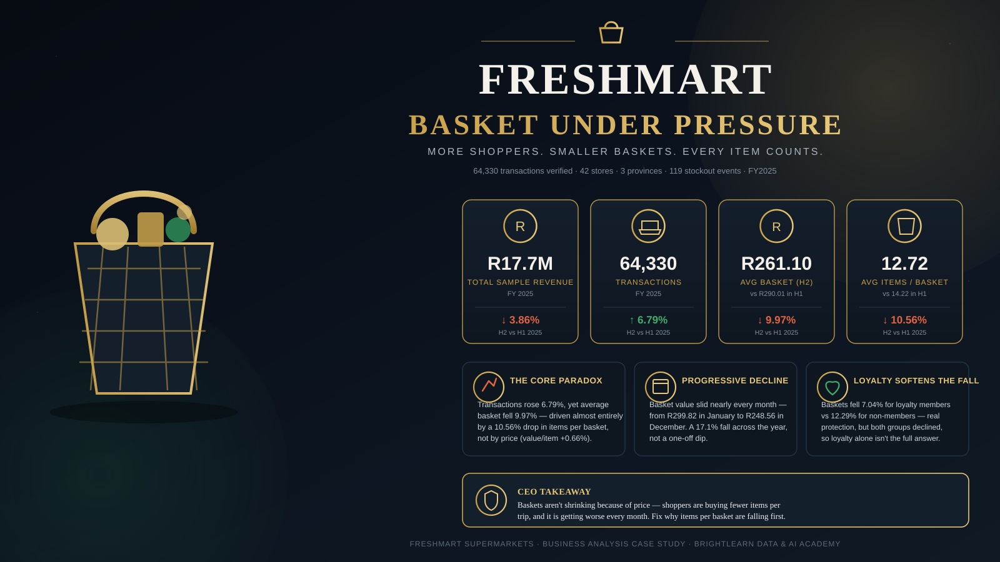

# Why Is FreshMart's Basket Getting Smaller?

A business analysis case study for FreshMart Supermarkets — a 42-store grocery chain across Gauteng, the Western Cape and KwaZulu-Natal. This project was completed as an individual assignment for the BrightLearn Data & AI Academy's Business Analysis programme.

## The problem I was asked to solve

More people are walking into FreshMart stores than a year ago, yet sales haven't grown to match. The Head of Retail Operations put it simply:

> "Footfall is up, but our sales aren't growing. It feels like people are buying less per visit. Find out what is going on, and tell us what to do about it."

That's a hunch, not a plan. My job was to turn it into a precise, evidence-backed answer: is basket size actually shrinking, where is it happening, why, and what should FreshMart do about it before the next budget cycle.

## What I was working with

FreshMart gave me a year of real-shaped (but sampled) operational data for 2025:

- **~64,000 till transactions** — one row per basket, with the store, date, day of week, whether the shopper was a loyalty member, how many items were in the basket, the rand value of the basket, and how they paid.
- **42 stores** — their province, format (Large / Medium /
